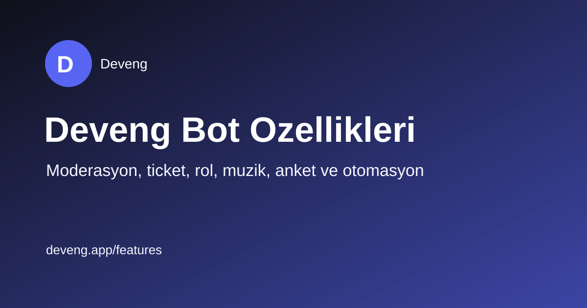
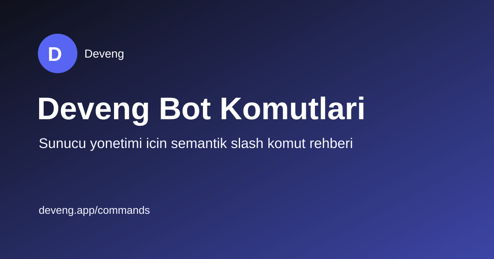
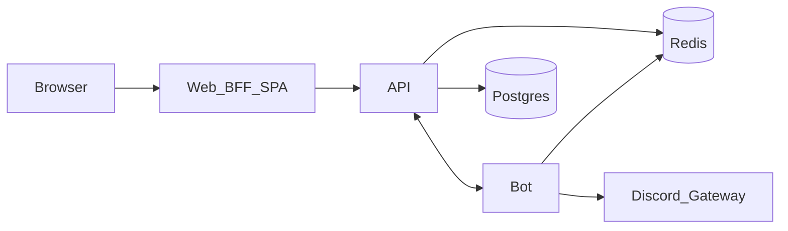

<p align="center">
  
</p>

<h1 align="center">Deveng Bot</h1>

<p align="center">
  <strong>Self-host Discord bot + web management panel</strong><br />
  Music, tickets, levels, moderation, automation — one Docker Compose stack.
</p>

<p align="center">
  <a href="LICENSE"></a>
  <a href="https://github.com/pinqponq/deveng-bot/actions/workflows/ci.yml"></a>
  
  
  
  
  
  
</p>

<p align="center">
  <a href="README.tr.md">Türkçe</a> ·
  <a href="#quick-start">Quick start</a> ·
  <a href="CONTRIBUTING.md">Contributing</a> ·
  <a href="SECURITY.md">Security</a>
</p>

---

## Why Deveng Bot?

Most Discord bots are either a closed SaaS or a pile of half-wired scripts. **Deveng Bot** ships as a real monorepo you can run on your own machine:

- **Panel** — guild-scoped dashboard (Vite + Express BFF)
- **API** — ASP.NET Core, Postgres, Redis, HMAC service auth
- **Bot** — discord.js gateway + HTTP control plane
- **Optional** — Lavalink music, Ollama AI moderation

```bash
docker compose up --build
```

| Service | URL |
|---------|-----|
| Panel | http://localhost:3000 |
| API health | http://localhost:9000/health |

---

## Features

| Area | What you get |
|------|----------------|
| Welcome / Goodbye | Join & leave messages with embeds |
| Tickets | Configurable panel + staff workflows |
| Music | Queue, playlists, radio (Lavalink profile) |
| Levels | XP, rewards, leaderboard |
| Giveaways | Role multipliers, scheduled ends |
| Temp voice | Owner controls, lock/hide/claim |
| Reaction roles | Button & emoji role maps |
| Moderation | Logs + optional AI moderation |
| Automation | Trigger → action flows |
| Polls, reminders, birthdays | Built-in slash + panel config |
| Private / custom bots | Multi-bot hosting paths |

<p align="center">
  
  &nbsp;
  
</p>

---

## Architecture



| Component | Path | Role |
|-----------|------|------|
| API | `Deveng.Discord/Deveng.Discord.Api` | ASP.NET Core API, Postgres, Redis |
| Worker | `Deveng.Discord/Deveng.Discord.Worker` | Optional scheduling worker |
| Web | `Deveng.Discord.Web` | Vite panel + Express BFF |
| Bot | `Deveng.Discord.Bot` | discord.js bot + HTTP control plane |

---

## Quick start

### 1. Discord application

1. Create an app at the [Discord Developer Portal](https://discord.com/developers/applications).
2. Enable the privileged intents you need (message content, members, presence).
3. OAuth2 → redirect: `http://localhost:3000/auth/discord/callback`
4. Copy **Application ID**, **Client Secret**, and **Bot Token**.

### 2. Environment

```powershell
cp .env.example .env
# Fill POSTGRES_PASSWORD, REDIS_PASSWORD, DISCORD_*, BOT_TOKEN,
# BOT_SHARED_SECRET, SESSION_SECRET (long random strings)
```

Also see:

- [`Deveng.Discord.Web/.env.example`](Deveng.Discord.Web/.env.example)
- [`Deveng.Discord.Bot/.env.example`](Deveng.Discord.Bot/.env.example)

### 3. Run

```powershell
docker compose up --build
```

Optional profiles:

```powershell
docker compose --profile music up --build   # Lavalink
docker compose --profile ai up --build      # Ollama (AI moderation)
```

Set `AI_MODERATION_PROVIDER=ollama` when using the `ai` profile.

### 4. Database migrations

```powershell
$env:ConnectionStrings__DefaultConnection = "Host=localhost;Port=5432;Database=deveng;Username=deveng;Password=<your-password>"
dotnet ef database update --project Deveng.Discord/Deveng.Discord.Infrastructure --startup-project Deveng.Discord/Deveng.Discord.Api
```

More detail: [`docs/LOCAL-SETUP.md`](docs/LOCAL-SETUP.md).

---

## Environment reference

| Variable | Required | Used by | Notes |
|----------|----------|---------|-------|
| `POSTGRES_*` | yes | compose/API | DB name/user/password |
| `REDIS_PASSWORD` | yes | compose/API/Bot | Redis `requirepass` |
| `DISCORD_CLIENT_ID` | yes | API/Web/Bot | Application ID |
| `DISCORD_CLIENT_SECRET` | yes | API/Web | OAuth2 |
| `DISCORD_REDIRECT_URI` | yes | API/Web | Must be allowlisted |
| `BOT_TOKEN` | yes | API/Bot/Web | Bot token |
| `BOT_SHARED_SECRET` | yes | API/Bot | HMAC between API↔Bot |
| `SESSION_SECRET` | yes | Web | Express session |
| `CORS_ORIGIN` / `PUBLIC_PANEL_BASE_URL` | yes | Web/API | Panel origin |
| `LAVALINK_*` | music profile | Bot | Music playback |
| `AI_MODERATION_*` / `OLLAMA_*` | ai profile | API | Optional AI moderation |
| `RABBITMQ_URI` | no | API | If unset, null message bus |

Secrets are injected via environment / `.env` only — images do **not** `COPY` `.env`.

---

## Local builds (Windows PowerShell)

```powershell
dotnet build Deveng.Discord/Deveng.Discord.Api/Deveng.Discord.Api.csproj -c Release
dotnet test Deveng.Discord/Deveng.Discord.Api.Tests/Deveng.Discord.Api.Tests.csproj -c Release

cd Deveng.Discord.Web; npm ci; npm run build
cd ..\Deveng.Discord.Bot; npm ci; npm run build

docker compose config
```

---

## Tech stack

- **Bot:** Node.js 22, discord.js 14, TypeScript, Vitest
- **Web:** React, Vite, TanStack Router/Query, Express BFF
- **API:** .NET 10, EF Core, NLog, Redis
- **Data:** PostgreSQL 16, Redis 7
- **Ops:** Docker Compose, GitHub Actions CI

---

## Contributing

See [`CONTRIBUTING.md`](CONTRIBUTING.md), [`CODE_OF_CONDUCT.md`](CODE_OF_CONDUCT.md), and [`SECURITY.md`](SECURITY.md).

PRs welcome — keep them focused, never commit secrets, and prefer working panel + API + bot paths over placeholders.

---

## Docs

- [`docs/README.md`](docs/README.md) — documentation index
- [`docs/ADDING-FEATURES.md`](docs/ADDING-FEATURES.md) — add a guild feature end-to-end (AI-friendly)
- [`AGENTS.md`](AGENTS.md) — guidance for Claude / Cursor agents
- [`docs/LOCAL-SETUP.md`](docs/LOCAL-SETUP.md) — local setup without full Compose

Built with Discord.js, ASP.NET Core, React, PostgreSQL, Redis, Lavalink.

---

## License

[MIT](LICENSE) © 2026 Deveng contributors
