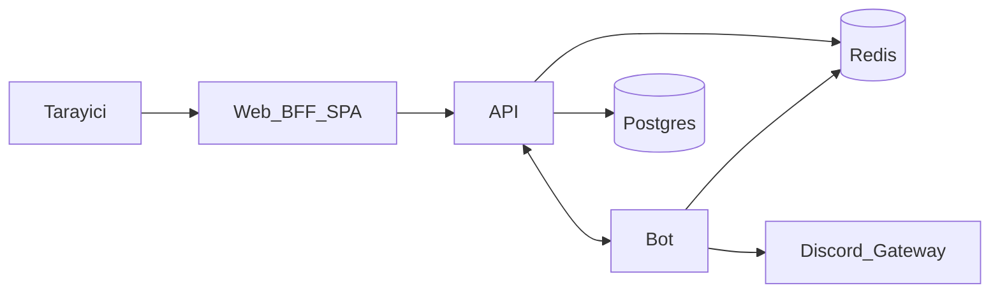

<p align="center">
  
</p>

<h1 align="center">Deveng Bot</h1>

<p align="center">
  <strong>Kendi sunucunda çalışan Discord bot + yönetim paneli</strong><br />
  Müzik, talepler, level, moderasyon, otomasyon — tek Docker Compose yığını.
</p>

<p align="center">
  <a href="LICENSE"></a>
  <a href="https://github.com/pinqponq/deveng-bot/actions/workflows/ci.yml"></a>
  
  
  
  
  
  
</p>

<p align="center">
  <a href="README.md">English</a> ·
  <a href="#hızlı-başlangıç">Hızlı başlangıç</a> ·
  <a href="CONTRIBUTING.md">Katkı</a> ·
  <a href="SECURITY.md">Güvenlik</a>
</p>

---

## Neden Deveng Bot?

Çoğu Discord botu ya kapalı SaaS’tır ya da yarım kalmış script yığınıdır. **Deveng Bot** kendi makinenizde çalıştırabileceğiniz gerçek bir monorepo olarak gelir:

- **Panel** — sunucu kapsamlı dashboard (Vite + Express BFF)
- **API** — ASP.NET Core, Postgres, Redis, HMAC servis kimlik doğrulama
- **Bot** — discord.js gateway + HTTP kontrol düzlemi
- **Opsiyonel** — Lavalink müzik, Ollama AI moderasyon

```bash
docker compose up --build
```

| Servis | URL |
|--------|-----|
| Panel | http://localhost:3000 |
| API health | http://localhost:9000/health |

---

## Özellikler

| Alan | Ne sunar |
|------|----------|
| Welcome / Goodbye | Embed’li giriş / çıkış mesajları |
| Talepler (Tickets) | Yapılandırılabilir panel + yetkili akışları |
| Müzik | Kuyruk, playlist, radyo (Lavalink profili) |
| Level | XP, ödüller, sıralama |
| Çekiliş | Rol çarpanı, zamanlanmış bitiş |
| Geçici ses | Sahip kontrolleri, kilitle / gizle / claim |
| Tepki rolleri | Buton ve emoji rol eşlemeleri |
| Moderasyon | Loglar + opsiyonel AI moderasyon |
| Otomasyon | Tetikleyici → aksiyon akışları |
| Anket, hatırlatıcı, doğum günü | Slash + panel yapılandırması |
| Özel / private bot | Çoklu bot barındırma yolları |

<p align="center">
  
  &nbsp;
  
</p>

---

## Mimari



| Bileşen | Yol | Rol |
|---------|-----|-----|
| API | `Deveng.Discord/Deveng.Discord.Api` | ASP.NET Core API, Postgres, Redis |
| Worker | `Deveng.Discord/Deveng.Discord.Worker` | Opsiyonel zamanlama worker’ı |
| Web | `Deveng.Discord.Web` | Vite panel + Express BFF |
| Bot | `Deveng.Discord.Bot` | discord.js bot + HTTP kontrol düzlemi |

---

## Hızlı başlangıç

### 1. Discord uygulaması

1. [Discord Developer Portal](https://discord.com/developers/applications) üzerinde uygulama oluşturun.
2. İhtiyacınız olan privileged intent’leri açın (message content, members, presence).
3. OAuth2 → redirect: `http://localhost:3000/auth/discord/callback`
4. **Application ID**, **Client Secret** ve **Bot Token** kopyalayın.

### 2. Ortam değişkenleri

```powershell
cp .env.example .env
# POSTGRES_PASSWORD, REDIS_PASSWORD, DISCORD_*, BOT_TOKEN,
# BOT_SHARED_SECRET, SESSION_SECRET doldurun (uzun rastgele dizeler)
```

Ayrıca:

- [`Deveng.Discord.Web/.env.example`](Deveng.Discord.Web/.env.example)
- [`Deveng.Discord.Bot/.env.example`](Deveng.Discord.Bot/.env.example)

### 3. Çalıştırma

```powershell
docker compose up --build
```

Opsiyonel profiller:

```powershell
docker compose --profile music up --build   # Lavalink
docker compose --profile ai up --build      # Ollama (AI moderasyon)
```

`ai` profilinde `AI_MODERATION_PROVIDER=ollama` kullanın.

### 4. Veritabanı migrasyonları

```powershell
$env:ConnectionStrings__DefaultConnection = "Host=localhost;Port=5432;Database=deveng;Username=deveng;Password=<sifreniz>"
dotnet ef database update --project Deveng.Discord/Deveng.Discord.Infrastructure --startup-project Deveng.Discord/Deveng.Discord.Api
```

Daha fazla: [`docs/LOCAL-SETUP.md`](docs/LOCAL-SETUP.md).

---

## Ortam değişkenleri özeti

| Değişken | Zorunlu | Kullanan | Not |
|----------|---------|----------|-----|
| `POSTGRES_*` | evet | compose/API | DB adı/kullanıcı/şifre |
| `REDIS_PASSWORD` | evet | compose/API/Bot | Redis `requirepass` |
| `DISCORD_CLIENT_ID` | evet | API/Web/Bot | Application ID |
| `DISCORD_CLIENT_SECRET` | evet | API/Web | OAuth2 |
| `DISCORD_REDIRECT_URI` | evet | API/Web | Allowlist’te olmalı |
| `BOT_TOKEN` | evet | API/Bot/Web | Bot token |
| `BOT_SHARED_SECRET` | evet | API/Bot | API↔Bot HMAC |
| `SESSION_SECRET` | evet | Web | Express session |
| `CORS_ORIGIN` / `PUBLIC_PANEL_BASE_URL` | evet | Web/API | Panel origin |
| `LAVALINK_*` | music profili | Bot | Müzik |
| `AI_MODERATION_*` / `OLLAMA_*` | ai profili | API | Opsiyonel AI |
| `RABBITMQ_URI` | hayır | API | Yoksa null bus |

Secret’lar yalnızca ortam / `.env` ile enjekte edilir — imajlar `.env` **COPY etmez**.

---

## Yerel derleme (Windows PowerShell)

```powershell
dotnet build Deveng.Discord/Deveng.Discord.Api/Deveng.Discord.Api.csproj -c Release
dotnet test Deveng.Discord/Deveng.Discord.Api.Tests/Deveng.Discord.Api.Tests.csproj -c Release

cd Deveng.Discord.Web; npm ci; npm run build
cd ..\Deveng.Discord.Bot; npm ci; npm run build

docker compose config
```

---

## Teknoloji

- **Bot:** Node.js 22, discord.js 14, TypeScript, Vitest
- **Web:** React, Vite, TanStack Router/Query, Express BFF
- **API:** .NET 10, EF Core, NLog, Redis
- **Veri:** PostgreSQL 16, Redis 7
- **Ops:** Docker Compose, GitHub Actions CI

---

## Katkı

[`CONTRIBUTING.md`](CONTRIBUTING.md), [`CODE_OF_CONDUCT.md`](CODE_OF_CONDUCT.md) ve [`SECURITY.md`](SECURITY.md) dosyalarına bakın.

PR’lar memnuniyetle karşılanır — odaklı tutun, secret commit etmeyin, yer tutucu yerine çalışan panel + API + bot yolu tercih edin.

---

## Dokümanlar

- [`docs/README.md`](docs/README.md) — doküman indeksi
- [`docs/ADDING-FEATURES.tr.md`](docs/ADDING-FEATURES.tr.md) — uçtan uca özellik ekleme (AI dostu)
- [`AGENTS.md`](AGENTS.md) — Claude / Cursor ajanları için giriş
- [`docs/LOCAL-SETUP.md`](docs/LOCAL-SETUP.md) — Compose’siz yerel kurulum

Discord.js, ASP.NET Core, React, PostgreSQL, Redis, Lavalink ile geliştirilmiştir.

---

## Lisans

[MIT](LICENSE) © 2026 Deveng contributors
